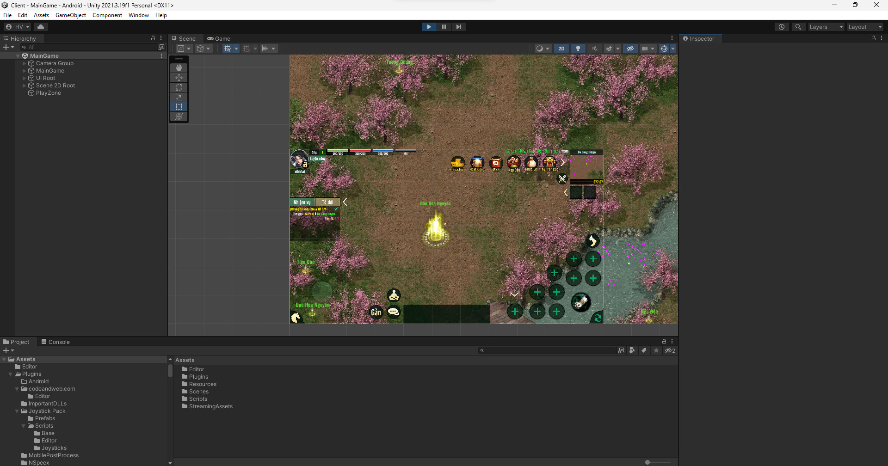
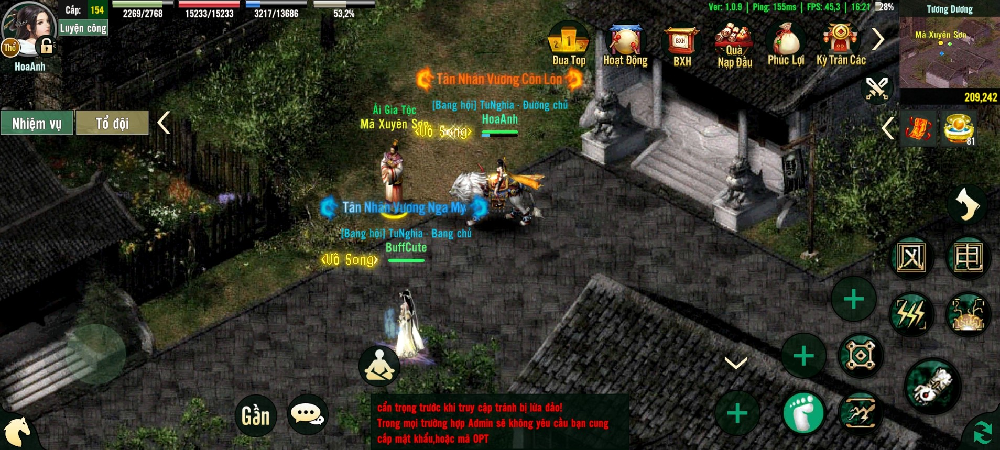
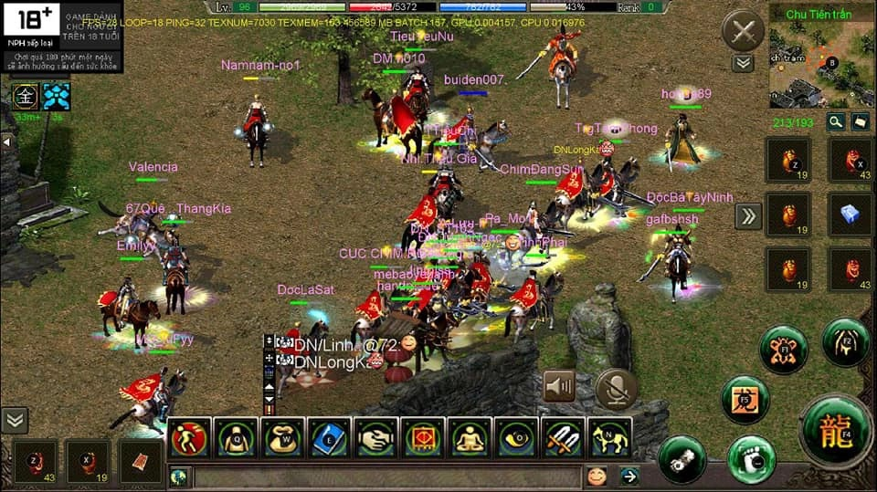
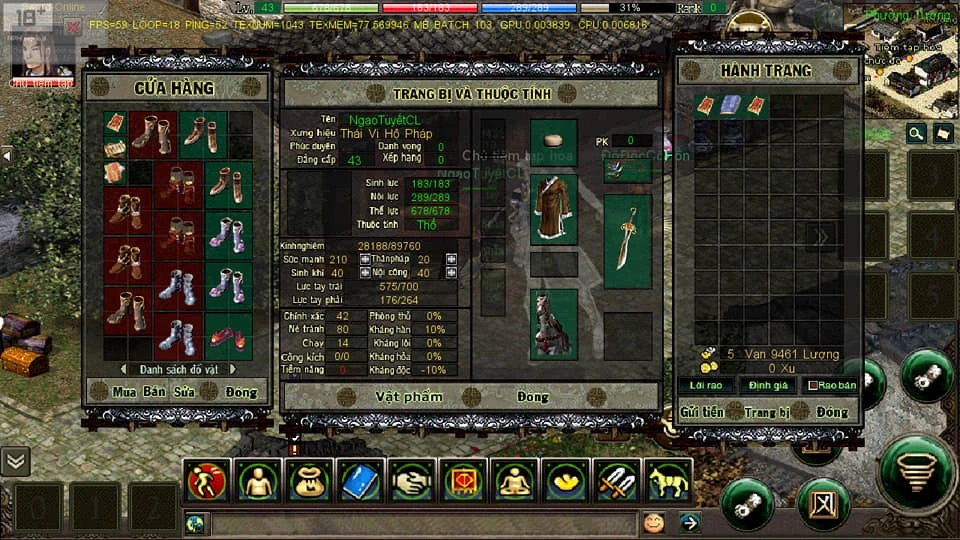

# Võ lâm truyền kỳ Mobile - jx1m
Đây là phiên bản Võ lâm truyền kỳ 1 được viết lại trên nền tảng Unity hỗ trợ các thiết bị di động mobile. Được chia sẻ lại từ bác [Tần Quỳnh](https://www.facebook.com/volamjx1412).

- Client: https://drive.google.com/file/d/1BliuxLDRRd5EXumk9Cp_uUmCUcJ5ptid/view

- Server: https://drive.google.com/file/d/1ii5jC15-ZE3aYzGSh96YWZKEoeU6cevZ/view

- Resources: https://drive.google.com/file/d/11n7s1S_7bhMUbalgctrM9eD5iByfPbAO/view

- DB: https://drive.google.com/file/d/1R1b78AU4beWhvS2Ss993KD5C15fF_FKr/view

Trao đổi với bác Quỳnh, bác cũng không có nhiều thông tin về phiên bản này nên mình đã thực hiện một cuộc khảo sát nhỏ tìm hiểu về mã nguồn của phiên bản này. Bên dưới là báo cáo ngắn gọn mình ghi nhận lại được.

## 1. Khảo sát

Mã nguồn hiện được chia sẻ trên mạng, mình sẽ để vài nguồn để anh em tiện bề tham khảo:

- https://hoilamgame.com/threads/sher-jx1-mobi-ban-dep-chuan-unity-cho-ae-ngoi-thu-dam.11456/

Buôn bán:

- https://kenhgamez.info/game/ban-source-jx1-mobile.157805/#post-833026
- https://clbgameviet.com/threads/12114-Ban-Full-Source-Game-Jx1-Mobi.html

Làm chung

- https://fbtag.net/d/333939-lo-source-jx-mobile-anh-em-nao-lam-cung-khong/4
- https://hoilamgame.com/threads/can-tim-anh-em-hop-tac-cung-lam-chung-jxm.11290/

## 2. Hướng dẫn cài đặt

Xem tại: https://vimeo.com/885985730?share=copy

<iframe src="https://player.vimeo.com/video/885985730?badge=0&amp;autopause=0&amp;quality_selector=1&amp;player_id=0&amp;app_id=58479" frameborder="0" allow="autoplay; fullscreen; picture-in-picture" style="position:absolute;top:0;left:0;width:100%;height:100%;" title="395391743_204354185943011_5942638685764345249_n"></iframe>

## 3. Vài ảnh minh hoạ

Mod lại về CTC

